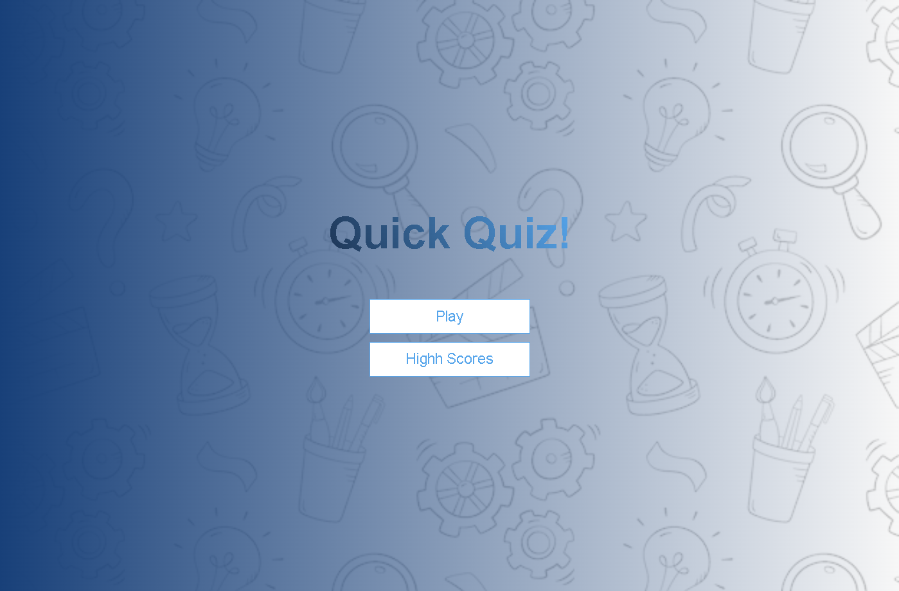
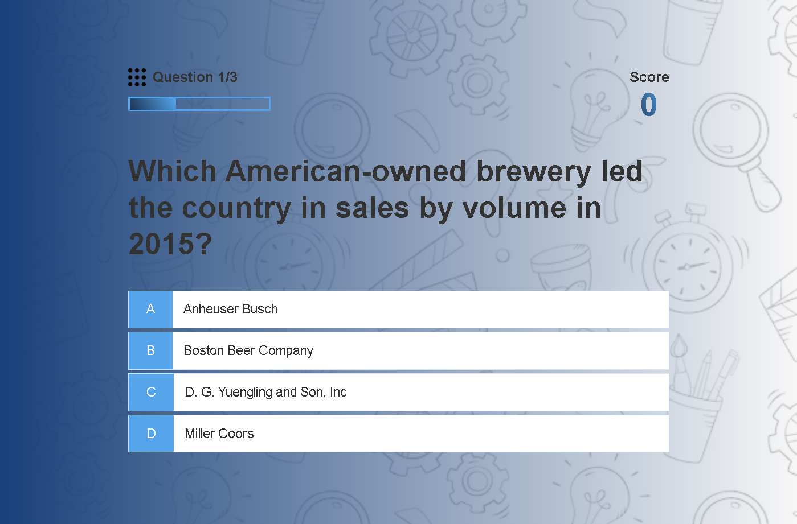
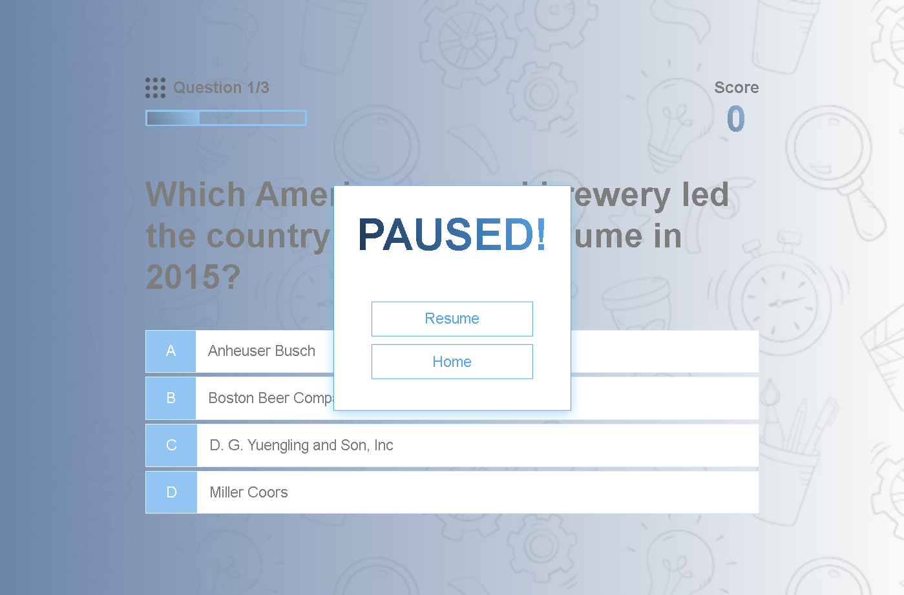
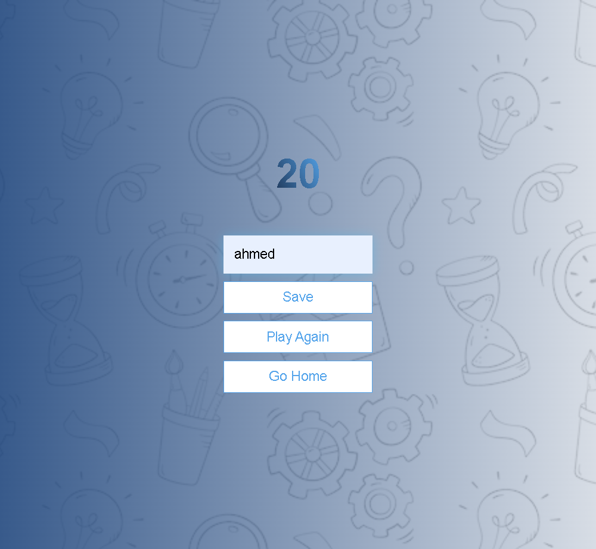

# Quiz_Quest-

## Table of contents

- [Overview](#overview)
  - [The challenge](#the-challenge)
  - [Screenshot](#screenshot)
  - [Links](#links)
- [My process](#my-process)
  - [Built with](#built-with)
  - [What I learned](#what-i-learned)
  - [Continued development](#continued-development)
- [Author](#author)
- [Acknowledgments](#acknowledgments)

## Overview

### The challenge

Create a trivia quiz game where users answer questions, track their scores, and view high scores. The game should include:
- A gameplay page where questions are displayed with multiple-choice answers.
- An end page where users can save their scores and view their final results.
- A high scores page to display the top scores.

### Screenshot
- Quiz_Quest: **Home screen**

- Quiz_Quest: **Game screen**

- Quiz_Quest: **Pause screen**

- Quiz_Quest: **End screen**

- Quiz_Quest: **HighScore screen**

### Links

- Solution URL: [https://github.com/hoor23/Quiz_Quest.git](https://github.com/hoor23/Quiz_Quest.git)
- Live Site URL: [ https://hoor23.github.io/Quiz_Quest/](https://hoor23.github.io/Quiz_Quest/)

## My process

### Built with

- **HTML**: For the structure of the game.
- **CSS**: For styling and layout.
- **JavaScript**: For game logic and functionality.
- **Open Trivia Database API**: For fetching trivia questions.

### What I learned

- **Handling Asynchronous Data**: Fetching and managing data from an external API.
- **Game State Management**: Using `localStorage` to save and retrieve game state.
- **Responsive Design**: Creating a responsive layout that adapts to different screen sizes.
- **Event Handling**: Implementing pause/resume functionality and interactive elements.

### Continued development

- **Enhanced Features**: Adding new game modes, difficulty levels, and question categories.
- **Improved UX**: Enhancing form validation and error handling.
- **Performance Optimization**: Refactoring code to improve performance and maintainability.
- **Expanded API Integration**: Integrating additional trivia sources or features.

## Author

- **GitHub**: [https://github.com/hoor23e](https://github.com/hoor23) 
- **Email**: [hoorseyda14@gmail.com](hoorseyda14@gmail.com)

## Acknowledgments

- **Open Trivia Database**: For providing a free and extensive trivia API.
- **Inspiration**: From various trivia and quiz games for design and functionality ideas.

